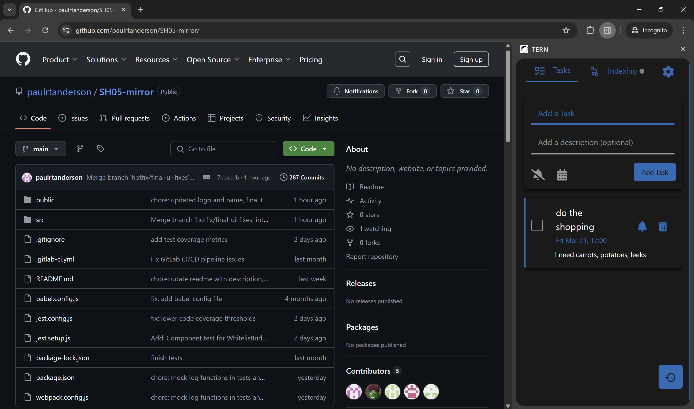
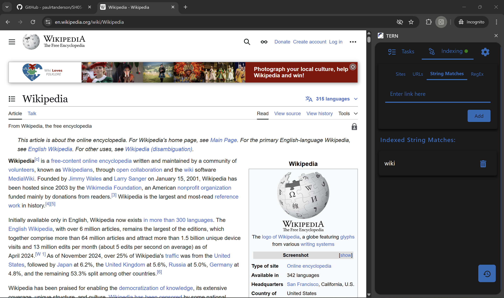

## Name
TERN

## Description

Extension combining a to-do list and indexing tool into one.

An indexing and productivity extension with convenient backup and recovery features.

Search through your browsing history by its contents — remember a word but not the page? Just search for it.

To begin searching indexed pages, type `@i` in the omnibar and press `Tab`.

Whitelist pages to be indexed by going to the **Indexing** tab and adding appropriate rules.

Keep your to-do lists and your documentation history all in one place.

## Badges
<!-- TODO: badges section -->

## Visuals
<h3>Sidebar view</h3>

<h3>Whitelisting rules view</h3>

<h3>Editing a task</h3>


## Installation

### Method 1: Install from chrome webstore
Install here :
https://chromewebstore.google.com/detail/fjbjdfdmnkbchdedikleeagadagmonbb?utm_source=item-share-cb

### Method 2: Download Prebuilt Extension

1. Download the latest ZIP file from the GitHub mirror:  
   https://github.com/paulrtanderson/SH05-mirror/releases

2. Unzip the archive and locate the `dist/` folder.

3. Open `chrome://extensions/` in a Chrome web browser.

4. Enable **Developer mode** (toggle in the top right corner).

5. Click **Load unpacked** (top left button).

6. Select the unzipped `dist/` folder.

---

### Method 3: Build from Source

1. **Install Node.js and npm** (if not already installed)  
   [Download here](https://nodejs.org/)

2. **Clone the repository**  
   You can use either of the following:

    ```bash
    # Primary repository
    git clone https://stgit.dcs.gla.ac.uk/team-project-h/2024/sh05/sh05-main.git

    # Or clone from the GitHub mirror if you lack the permissions
    git clone https://github.com/paulrtanderson/SH05-mirror.git

    cd sh05-main  # or cd SH05-mirror if you cloned from GitHub
    ```

3. **Install dependencies**

    ```bash
    npm install
    ```

4. **Build the extension**

    ```bash
    npm run build
    ```

    This will create a `dist/` folder in the current directory.

5. **Load the extension in Chrome**
   - Open `chrome://extensions/` in a Chrome web browser
   - Enable **Developer mode** (toggle in the top right corner)
   - Click **Load unpacked** (top left button)
   - Select the `dist/` folder

## Usage

- Click on the extension icon to open the sidebar.
- **Add tasks** using the input field.
- **Delete tasks** by clicking the **trash** icon.
- **Mark tasks as complete** by ticking the **checkbox**.
- **Set a due date** for a task by clicking the **calendar** icon or the **'no due date'** text beneath the task title.
- **Toggle an alarm** for a task by clicking the **bell** icon.  
  Alarms use **Chrome's built-in alarm system** and will trigger a notification. You can **snooze alarms for 1 hour** from the notification.

- **Recover deleted or completed tasks** by clicking the **recovery** icon in the bottom-right of the sidebar.

### Task Features

- **Task descriptions** are supported and hidden by default — they appear on **hover** or when **focused**.
- **Edit task titles** by double-clicking on the task title.
- **Edit task descriptions** by double-clicking on the description field.

### Quick Add Features

- **Right-click on any page** and select **“Add site to whitelist”** to quickly add the current site to the **Sites** list in the Indexing tab.
- **Highlight text**, then **right-click and select “Add task”** to open the sidebar with the selected text pre-filled as the task title.

### Indexing and Whitelisting Rules

In the **Indexing** tab, you can whitelist pages using four rule types:

- **Sites**: Whitelist an entire domain (e.g. `example.com`)
- **URLs**: Match only the exact URL
- **String Matches**: Whitelist any URL containing a specific string
- **Regex Rules**: Use regular expressions for advanced matching

A **green circle indicator** appears next to the **Indexing** tab:
- 🟢 Green if the current URL **matches a whitelist rule**
- ⚪ Grey if it **does not**


## Support
Contact us at ternextensionteam@gmail.com

## Roadmap

> **Note:** Active development ceased as of **2025-03-21**. No further updates are currently planned.  
> However, possible future features include:
- Sync tasks to outlook
- Integrate a local LLM that could be asked questions about a page
- Scheduled recurring tasks
- Firefox and Edge browser support

## Contributing
Contributions are locked to SH05 team members.

## Authors and Acknowledgement

Based on the original HAWK extension  
https://github.com/HawkExtensionTeam/Hawk

**Current Extension Developed by the SH05 2024/25 team:**
- Paul Anderson  
- Qiuran Bian  
- Lok Man Chan  
- Siqi Guo  
- Hannah Hussain

## License

Copyright (c) 2025  
Paul Anderson, Qiuran Bian, Lok Man Chan, Siqi Guo, Hannah Hussain

Permission is hereby granted, free of charge, to any person obtaining a copy  
of this software and associated documentation files (the "Software"), to deal  
in the Software without restriction, including without limitation the rights  
to use, copy, modify, merge, publish, distribute, sublicense, and/or sell  
copies of the Software, and to permit persons to whom the Software is  
furnished to do so, subject to the following conditions:

The above copyright notice and this permission notice shall be included in all  
copies or substantial portions of the Software.

THE SOFTWARE IS PROVIDED "AS IS", WITHOUT WARRANTY OF ANY KIND, EXPRESS OR  
IMPLIED, INCLUDING BUT NOT LIMITED TO THE WARRANTIES OF MERCHANTABILITY,  
FITNESS FOR A PARTICULAR PURPOSE AND NONINFRINGEMENT. IN NO EVENT SHALL THE  
AUTHORS OR COPYRIGHT HOLDERS BE LIABLE FOR ANY CLAIM, DAMAGES OR OTHER  
LIABILITY, WHETHER IN AN ACTION OF CONTRACT, TORT OR OTHERWISE, ARISING FROM,  
OUT OF OR IN CONNECTION WITH THE SOFTWARE OR THE USE OR OTHER DEALINGS IN THE  
SOFTWARE.

## Project Status

Development concluded on **2025-03-21**.  
